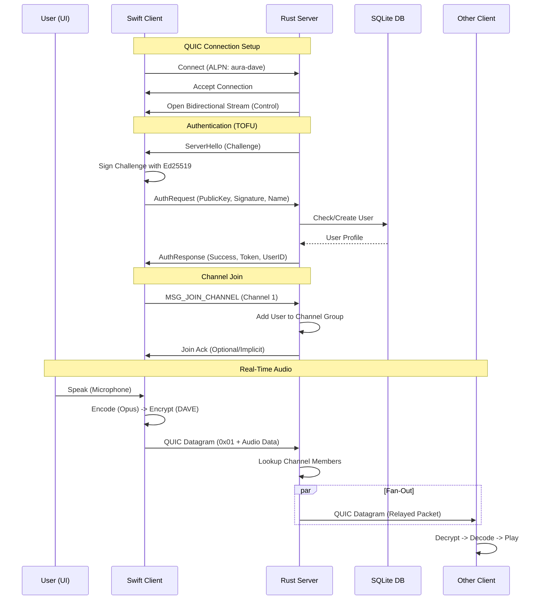

# Protocol Flow

This diagram illustrates the connection establishment, TOFU authentication, and real-time audio relay flow.

```mermaid
sequenceDiagram
    participant User as User (UI)
    participant Client as Swift Client
    participant Server as Rust Server
    participant DB as SQLite DB
    participant Other as Other Client

    Note over Client, Server: QUIC Connection Setup
    Client->>Server: Connect (ALPN: aura-dave)
    Server->>Client: Accept Connection
    Server->>Client: Open Bidirectional Stream (Control)

    Note over Client, Server: Authentication (TOFU)
    Server->>Client: ServerHello (Challenge)
    Client->>Client: Sign Challenge with Ed25519
    Client->>Server: AuthRequest (PublicKey, Signature, Name)
    Server->>DB: Check/Create User
    DB-->>Server: User Profile
    Server->>Client: AuthResponse (Success, Token, UserID)

    Note over Client, Server: Channel Join
    Client->>Server: MSG_JOIN_CHANNEL (Channel 1)
    Server->>Server: Add User to Channel Group
    Server->>Client: Join Ack (Optional/Implicit)

    Note over User, Other: Real-Time Audio
    User->>Client: Speak (Microphone)
    Client->>Client: Encode (Opus) -> Encrypt (DAVE)
    Client->>Server: QUIC Datagram (0x01 + Audio Data)
    Server->>Server: Lookup Channel Members
    par Fan-Out
        Server->>Other: QUIC Datagram (Relayed Packet)
    end
    Other->>Other: Decrypt -> Decode -> Play
```
