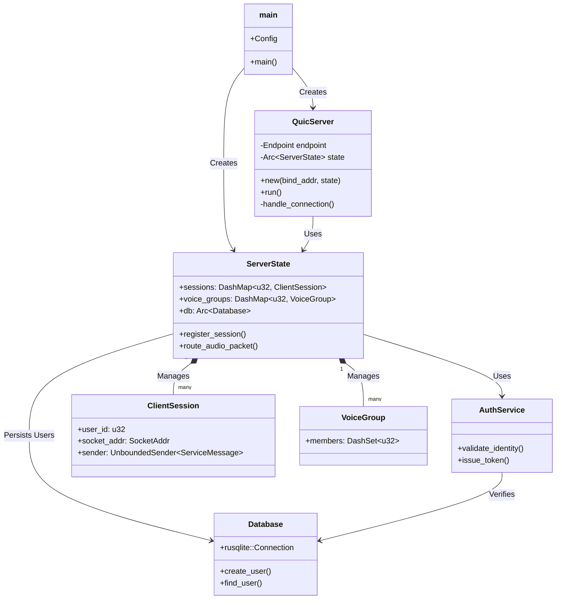

# Server Architecture

This diagram illustrates the high-level architecture of the `aura-server` crate (Rust).

```mermaid
classDiagram
    class main {
        +main()
        +Config
    }
    class QuicServer {
        -Endpoint endpoint
        -Arc~ServerState~ state
        +new(bind_addr, state)
        +run()
        -handle_connection()
    }
    class ServerState {
        +sessions: DashMap~u32, ClientSession~
        +voice_groups: DashMap~u32, VoiceGroup~
        +db: Arc~Database~
        +register_session()
        +route_audio_packet()
    }
    class AuthService {
        +validate_identity()
        +issue_token()
    }
    class Database {
        +rusqlite::Connection
        +create_user()
        +find_user()
    }
    class ClientSession {
        +user_id: u32
        +socket_addr: SocketAddr
        +sender: UnboundedSender~ServiceMessage~
    }
    class VoiceGroup {
        +members: DashSet~u32~
    }

    main --> QuicServer : Creates
    main --> ServerState : Creates
    QuicServer --> ServerState : Uses
    ServerState --> Database : Persists Users
    ServerState --> AuthService : Uses
    ServerState "1" *-- "many" ClientSession : Manages
    ServerState "1" *-- "many" VoiceGroup : Manages
    AuthService --> Database : Verifies
```
