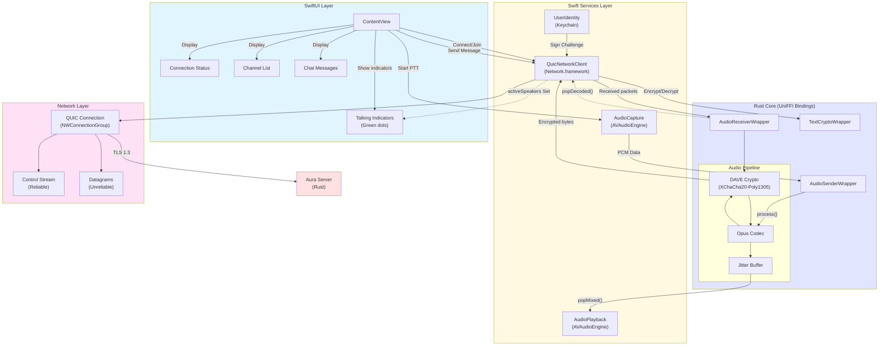
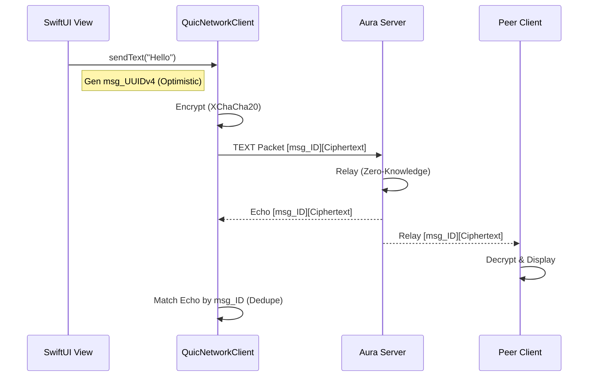

# Client Architecture

This diagram illustrates the architecture of the macOS Swift Client and its interaction with the Rust Core via UniFFI.

## Component Responsibilities

### SwiftUI Layer
- **ContentView** - Main UI, displays channels, users, chat, and talking indicators
- Observes `QuicNetworkClient` state for reactive updates

### Swift Services
- **QuicNetworkClient** - Manages QUIC connection, auth, channel join, message routing
  - Tracks `activeSpeakers: Set<UInt32>` for talking indicators
  - Handles transmit (`sendAudioDatagram`) and receive (`handleAudioPacket`)
- **AudioCapture** - Captures 48kHz mono PCM from microphone
- **AudioPlayback** - Plays mixed audio via AVAudioEngine
- **UserIdentity** - Manages Ed25519 keypair in Keychain

### Rust Core (UniFFI)
- **AudioSenderWrapper** - Encodes (Opus) + encrypts (DAVE) outgoing audio
- **AudioReceiverWrapper** - Decrypts + decodes + buffers incoming audio
  - Provides `popMixed()` for mixed audio from all senders
  - Provides `popDecoded()` for per-sender frames (talking indicators)
- **TextCryptoWrapper** - Encrypts/decrypts text messages

### Network Layer
- **QUIC** - TLS 1.3 encrypted transport
- **Control Stream** - Reliable ordered messages (auth, join, text, audio)
- **Datagrams** - Unreliable low-latency (future: audio packets)

## Data Flows

### Voice Transmit (Alice → Server → Bob)
1. Mic → AudioCapture → PCM Data
2. PCM → AudioSenderWrapper → Encrypted Packet
3. Packet → QuicNetworkClient → Control Stream (0x20)
4. Server relays to Bob's QuicNetworkClient
5. Bob's QuicNetworkClient → AudioReceiverWrapper → Decrypt/Decode
6. AudioReceiverWrapper.popMixed() → AudioPlayback → Speakers

### Talking Indicators
- AudioReceiverWrapper.popDecoded() returns `DecodedFrame[]` with `sessionId`
- QuicNetworkClient adds `sessionId` to `activeSpeakers` Set
- UI displays green dot next to users in `activeSpeakers`
- Expire after ~300ms of silence (timer in UI)

### Text Message Flow (Encrypted)

