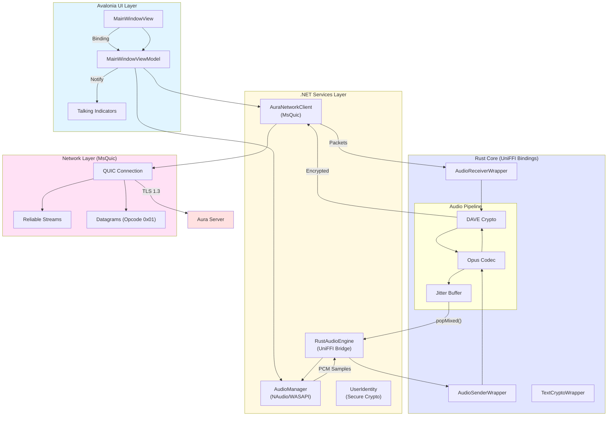

# Desktop Client Architecture (C#)

This diagram illustrates the architecture of the Windows/Desktop client built with .NET 8, Avalonia UI, and the Rust Core.

## Component Responsibilities

### Avalonia UI Layer
- **MainWindowView**: XAML-based interface for channels and chat.
- **MainWindowViewModel**: Reactive state management using `ReactiveUI` or `CommunityToolkit.Mvvm`.
- **Talking Indicators**: Bindings to `ActiveSpeakers` collection in the network client.

### .NET Services
- **AuraNetworkClient**: Manages the life cycle of the `MsQuic` connection. Handles control signaling and datagram fan-out.
- **AudioManager**: Interacts with Windows audio (WASAPI) using NAudio. Handles sample rate conversion.
- **RustAudioEngine**: C# wrapper for the UniFFI-generated `AudioSenderWrapper` and `AudioReceiverWrapper`.
- **UserIdentity**: Manages Ed25519 keys (likely using `System.Security.Cryptography`).

### Rust Core (UniFFI Bridge)
- Identical to the macOS implementation, ensuring cryptographic consistency across platforms.
- **AudioSenderWrapper**: Encodes + Encrypts.
- **AudioReceiverWrapper**: Decrypts + Decodes + Buffers.

## Platform Differences

| Feature | macOS (Swift) | Desktop (C#) |
|---------|---------------|--------------|
| **UI Framework** | SwiftUI | Avalonia UI |
| **Networking** | Network.framework | MsQuic (.NET) |
| **Audio API** | AVAudioEngine / AudioUnit | WASAPI / NAudio |
| **FFI Bridge** | UniFFI (Swift) | UniFFI (C#) |
| **Key Storage** | Apple Keychain | Windows Data Protection API |

## Data Flows

### Voice Receive Path
1. **MsQuic** receives an unreliable datagram (0x01).
2. **AuraNetworkClient** routes the payload to the UniFFI `AudioReceiverWrapper`.
3. **Rust Core** decrypts, decodes, and places the frame in the **Jitter Buffer**.
4. **AudioManager** periodically calls `popMixed()` on a high-priority audio thread.
5. Mixed PCM samples are pushed to **WASAPI** for playback.
