# Audio Pipeline Data Flow

This diagram details the transformation of audio data from microphone to speakers via the implemented Phase 1 architecture.

```mermaid
flowchart TB
    subgraph Transmit ["🎤 Transmit Path (Alice)"]
        Mic["Microphone<br/>(AVFoundation)"] -->|"Int16 PCM<br/>48kHz mono<br/>960 samples (20ms)"| AC["AudioCapture.swift"]
        AC -->|"Data"| QNC1["QuicNetworkClient<br/>.sendAudioDatagram()"]
        
        subgraph RustTx ["Rust Core (UniFFI)"]
            QNC1 -->|"[Int16]"| ASW["AudioSenderWrapper"]
            ASW -->|"Opus Encode"| OPUS1["Opus Codec<br/>(compress)"]
            OPUS1 -->|"~40 bytes"| DAVE1["DAVE Encryption<br/>(XChaCha20-Poly1305)"]
            DAVE1 -->|"Add nonce + tag"| PKT1["Encrypted Packet"]
        end
        
        PKT1 -->|"~100 bytes"| NET1["Control Stream<br/>(0x20 message)"]
    end
    
    NET1 -.->|"Zero-knowledge relay"| SERVER["🖥️ Aura Server<br/>(Rust)"]
    
    SERVER -.->|"Broadcast to<br/>voice group members"| NET2["Control Stream<br/>(0x20 message)"]
    
    subgraph Receive ["🔊 Receive Path (Bob)"]
        NET2 -->|"~100 bytes"| QNC2["QuicNetworkClient<br/>.handleAudioPacket()"]
        
        subgraph RustRx ["Rust Core (UniFFI)"]
            QNC2 -->|"[u8]"| ARW["AudioReceiverWrapper<br/>.onPacket()"]
            ARW -->|"Decrypt"| DAVE2["DAVE Decryption<br/>(XChaCha20-Poly1305)"]
            DAVE2 -->|"~40 bytes"| OPUS2["Opus Decoder<br/>(decompress)"]
            OPUS2 -->|"960 samples"| JB["Jitter Buffer<br/>(reorder)"]
            JB -->|"Buffered frames"| MIX["Audio Mixer<br/>(multi-sender)"]
            MIX -->|".popMixed()"| MIXED["[Int16] PCM"]
        end
        
        MIXED -->|"960 samples"| AP["AudioPlayback.swift<br/>.enqueue()"]
        AP -->|"Float32"| AVE["AVAudioEngine<br/>AVAudioPlayerNode"]
        AVE -->|"Analog audio"| SPK["Speakers<br/>(Output Device)"]
    end
    
    subgraph Indicators ["📊 Talking Indicators"]
        ARW -.->|".popDecoded()"| DEC["DecodedFrame[]<br/>(per sender)"]
        DEC -.->|"sessionId"| AS["activeSpeakers<br/>Set&lt;UInt32&gt;"]
        AS -.->|"UI polls"| UI["Green dot next to<br/>speaking users"]
    end

    style Mic fill:#e1f5e1
    style SPK fill:#e1f5e1
    style SERVER fill:#ffe1e1
    style ASW fill:#e1e5ff
    style ARW fill:#e1e5ff
    style AS fill:#fff9e1
```

## Key Components

### Transmit Path
1. **AudioCapture** - Captures 48kHz mono PCM from microphone (20ms frames)
2. **AudioSenderWrapper** - Rust wrapper exposing Opus encoding + DAVE encryption via UniFFI
3. **QuicNetworkClient** - Swift network layer, sends encrypted packets via control stream

### Receive Path
1. **QuicNetworkClient** - Receives encrypted packets from server
2. **AudioReceiverWrapper** - Rust wrapper for DAVE decryption + Opus decoding + jitter buffer
3. **AudioPlayback** - Swift AVAudioEngine playback, converts Int16 → Float32 and plays

### Talking Indicators
- `AudioReceiverWrapper.popDecoded()` returns frames with `sessionId` per speaker
- `activeSpeakers` Set tracks who's currently speaking
- UI can show visual indicators (green dots) next to active speakers

## Encryption

All audio is encrypted end-to-end using **DAVE Protocol** (XChaCha20-Poly1305):
- **Key**: Derived from MLS voice group secret (currently using session token for PoC)
- **Nonce**: 192-bit random nonce per packet (avoids birthday bound)
- **Authentication**: Poly1305 MAC tag ensures integrity
- **Server**: Cannot decrypt audio, acts as zero-knowledge relay
